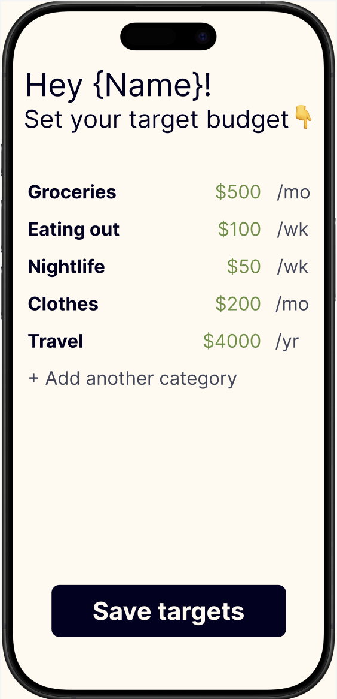
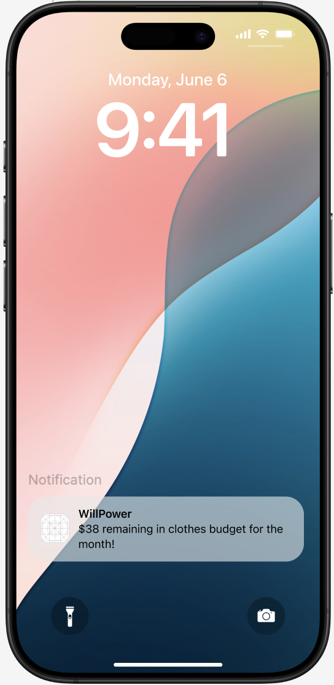

# FP2 - Evaluation of the Final Project

## Project Description
Title: Digital WillPower
Have you ever looked at your budget at the end of the month and realized you spent too much? Often, people change their behavior as a reaction to a realized cost. Digital WillPower will pair users' target budgets with location and transaction data to provide just-in-time information so people can make the right decision before they overspend. 

## Hifi Prototypes
![Prototype1]

![Prototype2]

# FP1 - Proposal for Critique

## Idea Sketches

### *Idea 1*

People make decisions everyday, but often do not have the best information to make them. We have all at the end of the month realized that we have overspent, whether it be on food, clothes, or some other budget category. This project's goal is to notify the user of the remaining budget in the relevant category when they enter a location or website of interest.

This will be interactive and engaging primarily through novelty, most people I have spoken with about this have not seen an application like this. Moreover, I plan to explore the various types of interventions that can be provided (descriptive, reflective, prescriptive, deliberative, etc). 

As for accessibility, I will follow programming and design standards, using semantic structure, alt text, and ensuring color contrast and other visual design standards are in place. Moreover, one part of product design I am passionate about is copy. Using simple language within the product does not only improve accessibility for those with cognitive disabilities, but also makes the product easier to use for everyone.

To go into higher detail, the application will have:
- goal entry (what is your budget per category)
- goal progress interface (main page of product)
- integration with transaction data via Plaid (to track goal progress)
- integration with Google Places API (to track location)
- if time remains post Google Places integration, I aim to figure out how to do this on digital sites as well.

The goal will be to have this deployed and complete enough that my peers can beta test it at the end of the semester.

### *Idea 2*

Similar to project 1, this project informs users of their remaining caloric budget in locations or websites of interest. The nuance here though is that it will sit on top of an activity recognition algorithm I am building in a different class in order to recognize eating. This would use that to prompt users to input their calories, and computer vision (likely Google Lens) to recognize the food and assist in calorie estimation.

Same interactivity and accessibility plan as above. 

More technical details of what the app would include:
- goal entry
- goal progress interface
- 'eating detected' notification (using algorithm from other class)
- calorie estimation workflow, with focus on aiming to be as close to automatic as possible, which could be done through:
    - integration with Google Lens API
    - integration with some Nutrition API

### *Idea 3*

Finally, this is a straightforward personal website, primarily aimed at Sr. Product Manager or Research Engineer roles. I will cover three main pillars: my product leadership acumen, technical acumen, and current focus of projects for the next chapter of my career. 

One means of interactivity I want to explore is different scroll behaviors, mainly in which the pages are focused on one 'row' at a time, and there is a sort of slow scroll in between that does most of the scroll all at once.

## Feedback Summary
The two main pieces of feedback I got were relevant to project 1 and 2. The first piece of feedback was from my TA and very valid, specifically for project 2: Have a backup plan in case the activity recognition project does not work out. 

The second piece of feedback was regarding goal entry. Specifically, the group was curious if part of these projects would be to help people identify their goals. This was a concern because that onboarding in and of itself can be fairly complex.

## Feedback Digestion
The way I plan to address the first point of feedback that I was received is to do the project that is related to budgeting. This avoids the dependency on the signal processing project, and ensures that the project is scoped to be able to complete it successfully within the course.

As for the second piece of feedback, I will be taking a naive approach to goal entry in this project, meaning that I assume people already know their goals and can enter them into the provided UI. The specific ramifications of this are having pre-set labels for budget categories, especially so that I can map those to location categories within the Google Places API.