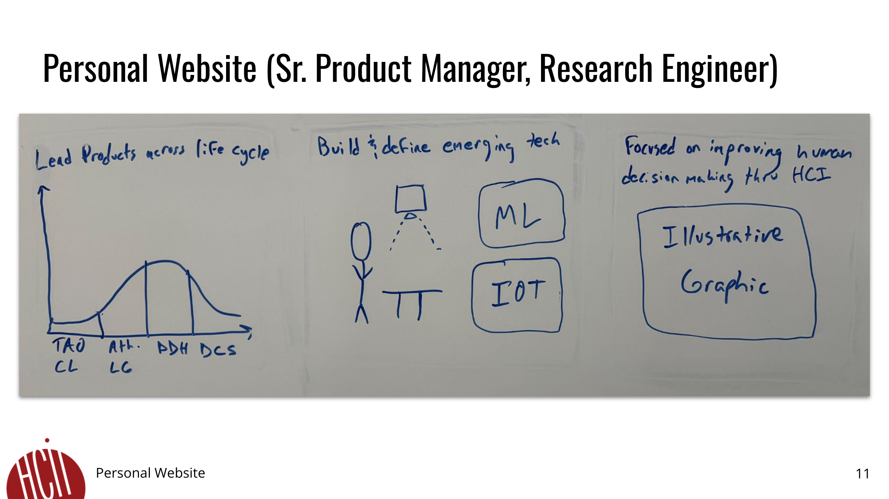

# FP2 - Evaluation of the Final Project

## Project Description
Title: Digital WillPower
Have you ever looked at your budget at the end of the month and realized you spent too much? Often, people change their behavior as a reaction to a realized cost. Digital WillPower will pair users' target budgets with location and transaction data to provide just-in-time information so people can make the right decision before they overspend. 

## Hifi Prototypes & Usability Tests
### *Prototype 1*

This mockup is the onboarding screen in which users can set up their target spend. There is a greeting atop the screen that will change based on first visit or returning user. The user is able to add or remove categories, and edit their spend targets and timeframe. I received positive feedback in user feedback sessions about the interaction desgin (editing and changing categories) but got insight that the language to refer to specific categories can change (users referred to gym budget as 'wellness' and 'gym'). Also, one user thought they should be able to edit the timeframe while editing the price

Using this feedback, I have updated the default categories to include wellness, and include editing the timeframe within the editing price interaction (they were separate before).

### *Prototype 2*

This mockup is the notification and represents the crux of this idea. I received positive user feedback with no need to edit. However, when talking about this idea with others, they have mentioned that it can seem like their device is scolding or lecturing them. I want to play with different intervention types (prescriptive, reflective, descriptive, etc) to see how behavior changes. 

Using this feedback, I have created several different intervention types. I do not think that usability testing or interviews are very meaningful research with these. I want to test this in-situ, and monitor spend change based on the different types.

## Updated Designs
### *Updated Prototype 1*

Added wellness as default, will include both price and timeframe within the same edit interaction.

Explored different intervention types. 

## Feedback Summary
The first point of feedback was a technical one: how can you establish that someone is 'visiting' a location? Is Google Places API precise enough to see that you are in one store versus another? What if I am just walking by a store and stop to talk to someone?

Both points are good feedback. I think that a time threshold can be applied, where if you are in the same location 1 min or so later (longer than a quick stop outside of a store but shorter than the minimum visit to a store), we can reasonably assume that you are in a store. As for the precision of the Places API, that is something that I investigated their documentation to get the answer to. Just using the GPS, they state 20m but the accuracy can be worse when inside buildings. However, they use Wifi to mitigate that, and are able to maintain the same level of accuracy within 20m. I will be investigating this more thoroughly during the building of the project.

## Milestones
Nov 4 - 10
* Send dummy notification when I enter a restaurant
* Assess precision of location

Nov 11 - 17
* Build primary interfaces for users to enter their targets
* Notify users when they enter a PoI of their category target
* Nov 13 - FP3 Check-in

Nov 18 - 24
* Integrate Plaid API to track transaction data
* Subtract spend from users' targets
* Notify users of remaining target

Nov 25 - Dec 1
* Polish UI
* (If time) build different intervention types

Dec 2 - 6
* FP4 due
* Deploy for beta usage

## Generative AI usage plan
I plan to use Generative AI to a moderate extent on this project. Specifically, I will use ChatGPT/Claude. 

### *Responsible Use*
I have a personal policy that I will spend at least 15-30 minutes trying to figure out a problem myself prior to using any GenAI, as I do think there is a lot of benefit in manually figuring something out. Please keep that in mind with the below usages.

Moreover, I will credit GenAI usage in my code accordingly. 

Finally, I do not plan to use GenAI as a creative tool. Maybe to refine ideas, but I hold that using GenAI for creativity will create a sort of regression to the mean of written thought on the internet.

### *Tool Use*
I will use it in the following ways:
- Debugging tool (it is really helpful to ask it why this code may not be working)
- Ask how I can improve the accessibility of my code
- Learn about the Google Places and Plaid APIs
- unblock me if I am stuck in a particular part of the project

I will not use it to:
- Write blocks of code for me
- Decide the direction of my project
- User test (AI is not a replacement for users IMO)

---
# FP1 - Proposal for Critique

## Idea Sketches

### *Idea 1*

People make decisions everyday, but often do not have the best information to make them. We have all at the end of the month realized that we have overspent, whether it be on food, clothes, or some other budget category. This project's goal is to notify the user of the remaining budget in the relevant category when they enter a location or website of interest.

This will be interactive and engaging primarily through novelty, most people I have spoken with about this have not seen an application like this. Moreover, I plan to explore the various types of interventions that can be provided (descriptive, reflective, prescriptive, deliberative, etc). 

As for accessibility, I will follow programming and design standards, using semantic structure, alt text, and ensuring color contrast and other visual design standards are in place. Moreover, one part of product design I am passionate about is copy. Using simple language within the product does not only improve accessibility for those with cognitive disabilities, but also makes the product easier to use for everyone.

To go into higher detail, the application will have:
- goal entry (what is your budget per category)
- goal progress interface (main page of product)
- integration with transaction data via Plaid (to track goal progress)
- integration with Google Places API (to track location)
- if time remains post Google Places integration, I aim to figure out how to do this on digital sites as well.

The goal will be to have this deployed and complete enough that my peers can beta test it at the end of the semester.

### *Idea 2*

Similar to project 1, this project informs users of their remaining caloric budget in locations or websites of interest. The nuance here though is that it will sit on top of an activity recognition algorithm I am building in a different class in order to recognize eating. This would use that to prompt users to input their calories, and computer vision (likely Google Lens) to recognize the food and assist in calorie estimation.

Same interactivity and accessibility plan as above. 

More technical details of what the app would include:
- goal entry
- goal progress interface
- 'eating detected' notification (using algorithm from other class)
- calorie estimation workflow, with focus on aiming to be as close to automatic as possible, which could be done through:
    - integration with Google Lens API
    - integration with some Nutrition API

### *Idea 3*

Finally, this is a straightforward personal website, primarily aimed at Sr. Product Manager or Research Engineer roles. I will cover three main pillars: my product leadership acumen, technical acumen, and current focus of projects for the next chapter of my career. 

One means of interactivity I want to explore is different scroll behaviors, mainly in which the pages are focused on one 'row' at a time, and there is a sort of slow scroll in between that does most of the scroll all at once.

## Feedback Summary
The two main pieces of feedback I got were relevant to project 1 and 2. The first piece of feedback was from my TA and very valid, specifically for project 2: Have a backup plan in case the activity recognition project does not work out. 

The second piece of feedback was regarding goal entry. Specifically, the group was curious if part of these projects would be to help people identify their goals. This was a concern because that onboarding in and of itself can be fairly complex.

## Feedback Digestion
The way I plan to address the first point of feedback that I was received is to do the project that is related to budgeting. This avoids the dependency on the signal processing project, and ensures that the project is scoped to be able to complete it successfully within the course.

As for the second piece of feedback, I will be taking a naive approach to goal entry in this project, meaning that I assume people already know their goals and can enter them into the provided UI. The specific ramifications of this are having pre-set labels for budget categories, especially so that I can map those to location categories within the Google Places API.